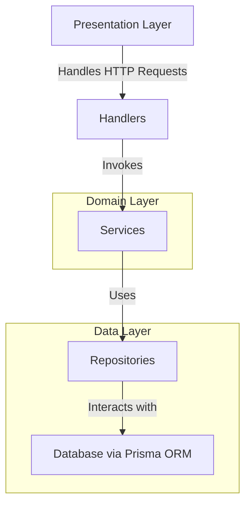
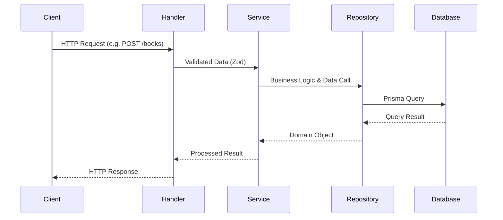
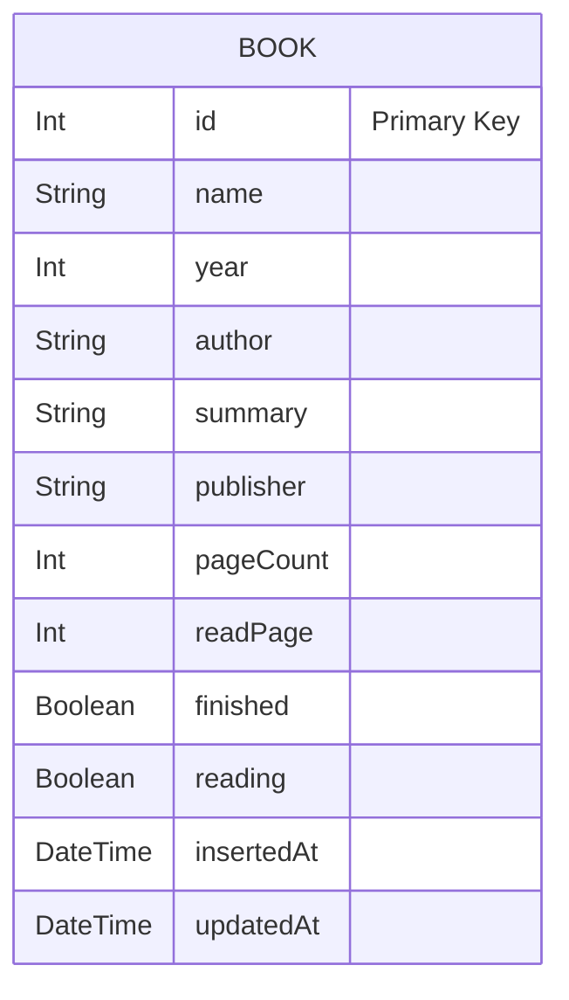

# 📚 **Bookshelf API Backend**

Backend untuk aplikasi **Bookshelf**, dibangun dengan **Hapi.js** dan **TypeScript**, mengikuti prinsip **Clean Architecture** agar mudah dikembangkan, diuji, dan dipelihara dalam jangka panjang.

---

## 🧩 **Clean Architecture Overview**



### ✳️ Penjelasan Singkat

- **Handler (Presentation Layer)** → menerima `request`, memvalidasi input (Zod), dan mengembalikan `response`.
- **Service (Domain Logic)** → berisi logika bisnis inti seperti validasi data unik, transformasi data, dsb.
- **Repository (Data Layer)** → berinteraksi langsung dengan **Prisma ORM** untuk query database.
- **Entity/Model** → mendefinisikan struktur data domain (tidak bergantung framework).

---

## 📂 **Struktur Folder**

```
📦 bookshelf-api
├── 📂 api/                 # Entry point untuk server Hapi.js
│   ├── server.ts
│   └── index.ts
│
├── 📂 src/
│   ├── 📂 handlers/        # Hapi route handler (controller)
│   ├── 📂 routes/          # Definisi endpoint dan binding handler
│   ├── 📂 services/        # Logika bisnis utama
│   ├── 📂 repositories/    # Akses data ke Prisma ORM
│   ├── 📂 entities/        # Entitas domain (Book, etc.)
│   ├── 📂 schemas/         # Validasi input (Zod)
│   ├── 📂 utils/           # Helper function (misal: handleError)
│   ├── 📂 middleware/      # (opsional) untuk autentikasi / logging
│   ├── 📂 types/           # Definisi tipe TypeScript umum
│   └── 📂 docs/            # Dokumentasi OpenAPI / Swagger
│
├── 📂 prisma/              # Prisma schema & migrations
├── 📂 public/swagger-ui/   # Swagger UI static assets
├── tsconfig.json
├── package.json
└── README.md
```

---

## 🧠 **Arus Data (Request Flow)**



---

## 📜 **API Endpoints**

### 📘 Books

| Method   | Endpoint          | Description                      |
| -------- | ----------------- | -------------------------------- |
| `GET`    | `/api/books`      | Ambil semua buku                 |
| `GET`    | `/api/books/{id}` | Ambil detail buku berdasarkan ID |
| `POST`   | `/api/books`      | Tambahkan buku baru              |
| `PUT`    | `/api/books/{id}` | Perbarui data buku               |
| `DELETE` | `/api/books/{id}` | Hapus buku berdasarkan ID        |

---

## 🗄️ **Database Schema (ERD)**



---

## 🧰 **Swagger / OpenAPI Docs**

Swagger digunakan untuk dokumentasi API otomatis.

- File definisi: `src/docs/openapi.yaml`
- Akses di browser:

  ```
  http://localhost:5000/api/docs
  ```

- Aset statis: `public/swagger-ui/`

> Kamu bisa generate otomatis spesifikasi Swagger dari file route menggunakan plugin seperti **hapi-swagger**.

---

## ⚙️ **Menjalankan Proyek**

### 1️⃣ Instalasi

```bash
git clone https://github.com/yourusername/bookshelf-api.git
cd bookshelf-api
npm install
```

### 2️⃣ Setup Database (Prisma)

```bash
npx prisma migrate dev
```

### 3️⃣ Jalankan Server

```bash
npm run dev
```

Atau build TypeScript-nya terlebih dahulu:

```bash
npm run build && npm start
```

---

## 🧩 **Script Penting**

| Command             | Fungsi                                    |
| ------------------- | ----------------------------------------- |
| `npm run dev`       | Menjalankan server dalam mode development |
| `npm run build`     | Compile TypeScript ke JavaScript          |
| `npm start`         | Menjalankan hasil build                   |
| `npx prisma studio` | Buka Prisma GUI untuk melihat data        |

---

## 🧾 **Lisensi**

Proyek ini menggunakan lisensi **MIT** — bebas digunakan dan dimodifikasi dengan atribusi.

---

## 💬 **Kontribusi**

Kontribusi sangat diterima!
Silakan buat _pull request_ atau _issue_ jika ingin menambah fitur, memperbaiki bug, atau memperindah dokumentasi.

---

## 🔧 (Opsional) Generate README Otomatis dari Swagger

Jika kamu ingin update dokumentasi endpoint secara otomatis:

```bash
npx widdershins ./src/docs/openapi.yaml -o README.md
```

---
